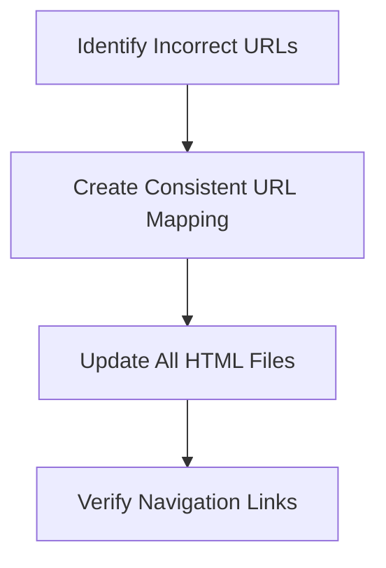
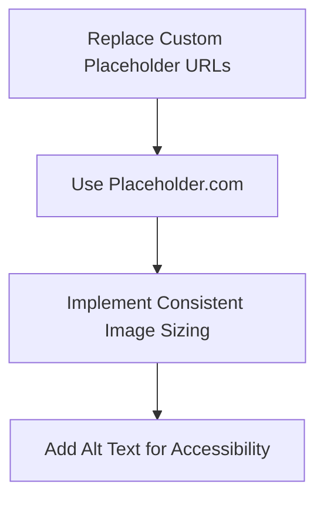
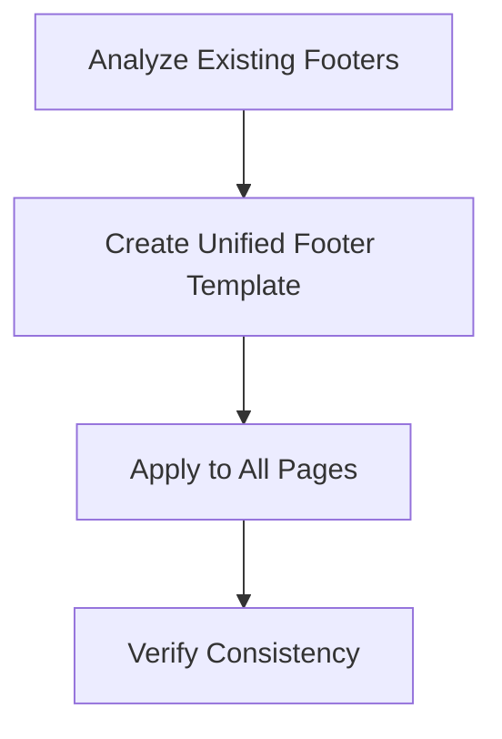
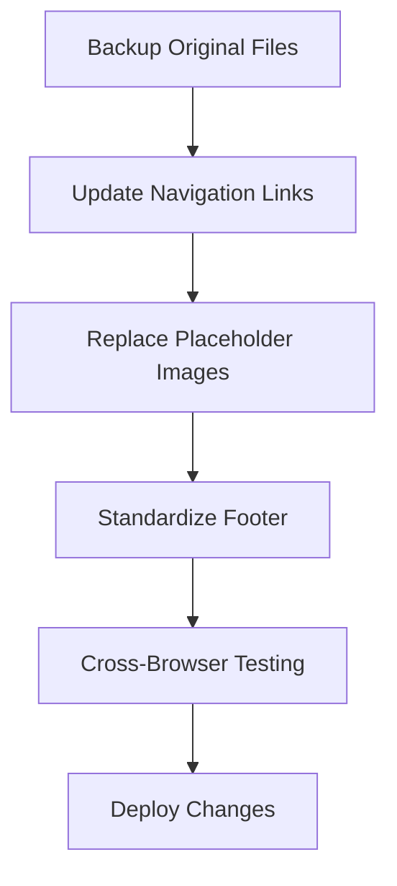

# Website Consistency Improvement Plan

## Overview
The goal is to improve the consistency and user experience of the MAD Communications website by addressing navigation, placeholder images, and footer design.

## Detailed Plan

### 1. Navigation URL Corrections

#### URL Mapping
- `/about.html` → `/about-us.html` ✓
- `/services.html` → `/service.html` ✓
- Ensure all internal links use correct paths

### 2. Placeholder Image Standardization

#### Placeholder Strategy
- Replace `/api/placeholder/...` with `https://via.placeholder.com/`
- Maintain original image dimensions
- Example: 
  - `/api/placeholder/1200/600` → `https://via.placeholder.com/1200x600`
  - `/api/placeholder/112/28` → `https://via.placeholder.com/112x28`

### 3. Footer Standardization

#### Footer Elements
- Company Names: 
  - Shenzhen Aichuqu Marketing Consulting Co., Ltd.
  - Mad Communications Limited
- Copyright: `© 2018-2025 All Rights Reserved`
- Social Icons:
  - WeChat
  - LinkedIn
  - Email Contact

### 4. Implementation Strategy

## Validation Checklist
- [ ] All navigation links are correct
- [ ] Placeholder images use Placeholder.com
- [ ] Footer is consistent across all pages
- [ ] No broken links
- [ ] Responsive design maintained

## Potential Risks
- Temporary SEO impact due to URL changes
- Potential broken links in external references

## Recommended Next Steps
1. Create backup of current website
2. Implement changes in a staging environment
3. Thoroughly test all pages
4. Deploy to production